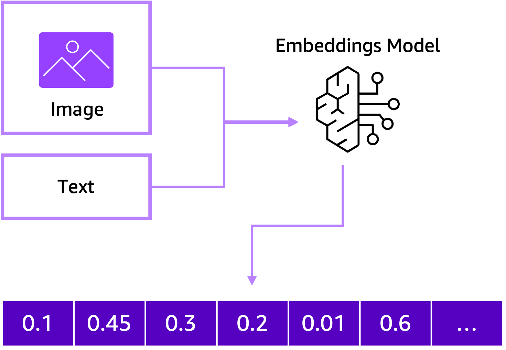
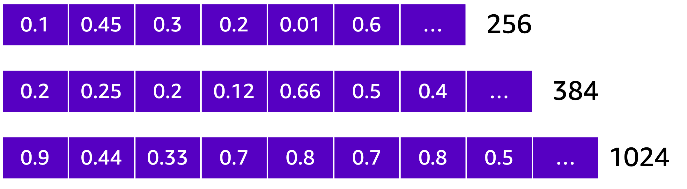
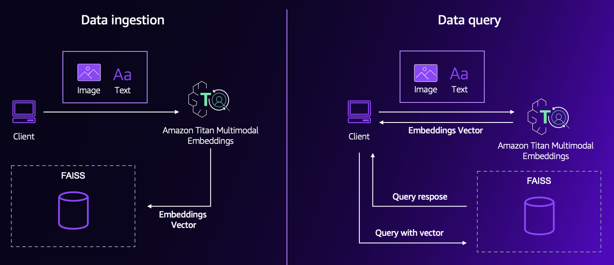

# Getting Started
### Overview

Multimodal embeddings are an emerging field focused on developing optimized techniques to efficiently represent and combine different data modalities, such as text, images, and audio, into a unified vector representation.



Multimodal embeddings leverage the principle of "joint representation", this means that the model is given multiple modalities (e.g., text and images) and learns to represent them in a shared embedding space. By combining different modalities, the model can capture the rich semantics and relationships between them, leading to more comprehensive and robust representations.

### About the notebook

In this notebook, you will learn the fundamentals of how to invoke Amazon Titan Multimodal Embeddings (TMME) through Amazon Bedrock.

**Defining the output embeddings**

You will begin defining the output embedding length for Titan Multimodal Embeddings, which allows us to choose from three vector sizes: 1024 (default), 384, or 256. The different vector sizes offer a trade-off between embedding quality and computational efficiency. Larger vector sizes capture more detailed information but require more computational resources, while smaller vector sizes are more efficient but may sacrifice some embedding quality. The choice depends on the specific requirements of the use case, balancing accuracy needs with resource constraints.



**Convert images and text to embeddings**

To retrieve embeddings for an image, we create a function called `get_embeddings_of_image`. This function takes an image file path and the desired output embedding length as input. Here's how it works:

```python
def get_embeddings_of_image(image, outputEmbeddingLength=outputEmbeddingLength):
    with open(image, "rb") as image_file:
        imageEncoded = base64.b64encode(image_file.read()).decode('utf8')

    body = json.dumps(
        {
            "inputImage": imageEncoded,
            "embeddingConfig": {
                "outputEmbeddingLength": outputEmbeddingLength
            }
        }
    )

    response = bedrock_runtime.invoke_model(
        body=body,
        modelId="amazon.titan-embed-image-v1",
        accept="application/json",
        contentType="application/json"
    )

    vector = json.loads(response['body'].read().decode('utf8'))
    return vector

```

First, the image file is read and encoded using Base64. Then, a JSON payload is constructed with the encoded image and the desired embedding length configuration. This payload is sent to the Amazon Bedrock runtime, which invokes the "amazon.titan-embed-image-v1" model to generate the embeddings. Finally, the response from Amazon Bedrock is parsed, and the embedding vector is returned.

**Store and retrieve embeddings in a vector database**

Now that you know how to get embeddings for your content, you are going to store them in a vector database to later query and retrieve results. In this case, you are going to use FAISS (Facebook AI Similarity Search), a library for efficient similarity search and clustering of dense vectors.

First, you need to populate the vector database with the embeddings of your content by transforming your data (text, images, or a combination) into embedding vectors and storing them in the FAISS vector database.



Once the vector database is populated, you can query it by transforming the input query (text, image, or multimodal) into an embedding vector. Then, you can perform a similarity search against the vector database using FAISS, which will identify the nearest neighbor vectors based on their cosine similarity or other distance metrics.

The search results will include the closest vectors and their associated data identifiers or metadata, allowing you to retrieve the original content related to those vectors. This enables applications like semantic search, content recommendation, and clustering based on the underlying meaning of your data.

### Clean-up

Amazon Bedrock is a managed service which offers pay-per-use, so we don't need to worry about shutting down instances to avoid cost. Since we used FAISS locally in our notebook, you only need to shut down the kernel notebook.