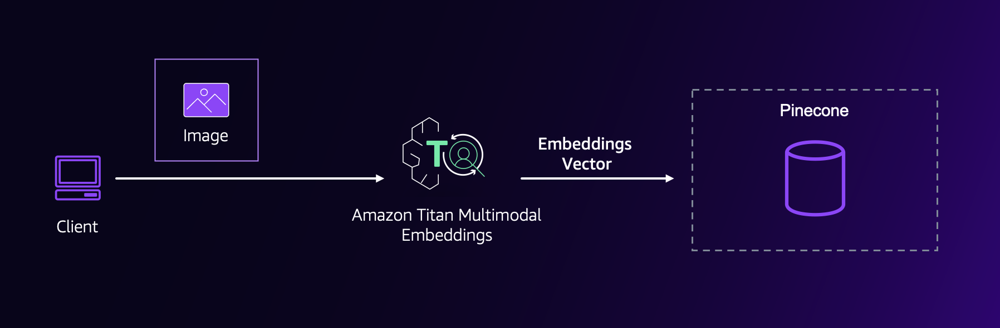
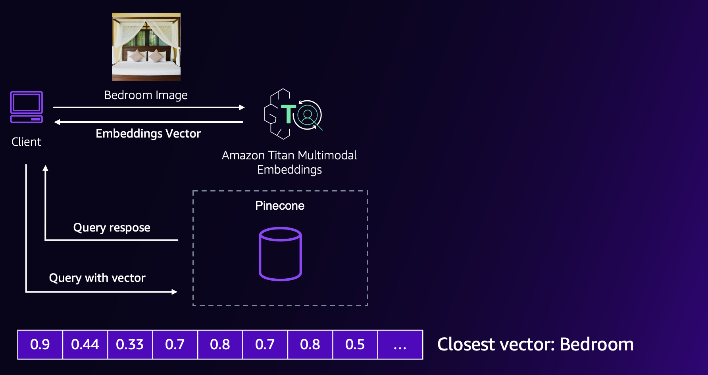
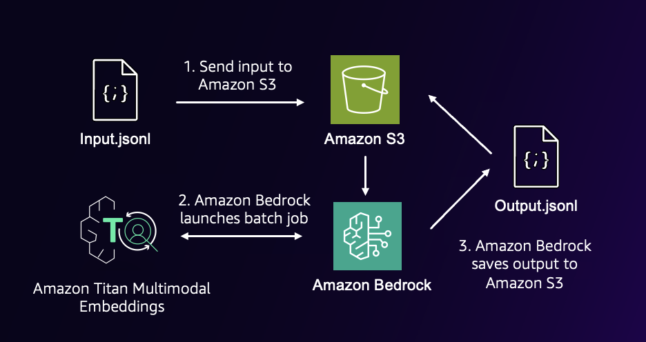
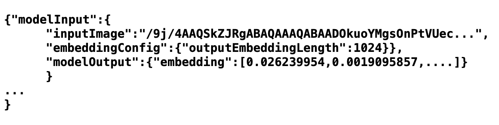

# Image Clustering

### Overview

Image clustering is a technique used to group similar images together based on their visual characteristics, such as color, texture, and content. It is a fundamental task in computer vision and has numerous applications, including image organization, retrieval, and analysis.

Traditionally, image clustering has relied on low-level features extracted from the pixel data, such as color histograms or edge descriptors. However, with the advent of deep learning and multimodal embeddings, it is now possible to capture the semantic content of images more effectively.

By leveraging multimodal embeddings from services like Amazon Titan Multimodal Embeddings (TMME) in Amazon Bedrock, we can generate rich representations of images that go beyond low-level features. These embeddings can then be stored in vector databases, which allow efficient similarity searches and clustering based on the semantic content of the images.


### About the notebook

In this Jupyter Notebook, we will explore the power of multimodal embeddings for image clustering, with the goal of classifying images into three categories: kitchen, bedroom, and bathroom. By combining the capabilities of vector databases and Amazon TMME, we can unlock new possibilities for image organization, retrieval, and analysis based on the underlying meaning and context of the images.

Additionally, we will leverage Amazon Bedrock Batch Inference to efficiently generate embeddings for a large number of images, enabling scalable and efficient image clustering workflows.

**Retrieve image embeddings**

To retrieve embeddings for an image, we create a function called `get_embeddings_of_image`. This function takes an image file path and the desired output embedding length as input. Here's how it works:

```python
def get_embeddings_of_image(image, outputEmbeddingLength=outputEmbeddingLength):
    with open(image, "rb") as image_file:
        imageEncoded = base64.b64encode(image_file.read()).decode('utf8')

    body = json.dumps(
        {
            "inputImage": imageEncoded,
            "embeddingConfig": {
                "outputEmbeddingLength": outputEmbeddingLength
            }
        }
    )

    response = bedrock_runtime.invoke_model(
        body=body,
        modelId="amazon.titan-embed-image-v1",
        accept="application/json",
        contentType="application/json"
    )

    vector = json.loads(response['body'].read().decode('utf8'))
    return vector

```

**Store the embeddings in a vector database**

To store the image embeddings in a vector database, we will be using Pinecone, a managed vector database service designed for high-performance similarity search and retrieval.



Before we can start storing embeddings in Pinecone, you will need to create a free account on their platform. The free account includes a complimentary index, which will allow you to test and experiment with the service.

Once you have created your account, you will need to retrieve your API key. This key will be used to authenticate and establish a connection between your Jupyter Notebook and the Pinecone service.

Here are the steps to set up the Pinecone connection:

1. Import the necessary Python libraries:

```python
from pinecone import Pinecone, PodSpec
```

1. Initialize the Pinecone client with your API key:

```python
pinecone =  Pinecone(api_key="your_api_key_here")
```

Replace `"your_api_key_here"` with the API key you obtained from your Pinecone account.

1. Create or retrieve an index in Pinecone:

```python
index_name = "house-rooms"
pinecone.create_index(index_name,
        dimension=outputEmbeddingLength,
        metric='cosine',
        spec=PodSpec(environment="gcp-starter"))

```

This code creates a new index called "house-rooms" with a vector dimension of your choice (adjust this based on your embedding size). If the index already exists, it will retrieve the existing index.

With the Pinecone connection established and the index ready, you can now store your image embeddings in the vector database. You can use the `index.upsert` method to add or update vectors in the index.

**Clustering the test images into groups**

By leveraging Pinecone's efficient similarity search capabilities, you can query the vector database to find similar images based on their embeddings, enabling powerful image clustering and retrieval applications.

To do this, you'll first transform your input image into an embedding vector using the same embedding function used to populate the database. Then, you'll compare this query vector to the vectors in the Pinecone database, retrieving the nearest neighbors based on a distance metric like cosine similarity.





By analyzing the metadata or labels associated with these nearest neighbor images, you can classify your input image into the appropriate category (e.g., kitchen, bedroom, or bathroom), assuming that similar embeddings belong to the same cluster.

```python
test_images_classification()

Photo: test-images/kitchen_21.jpg is type kitchen
Photo: test-images/kitchen_23.jpg is type kitchen
Photo: test-images/bed_23.jpg is type bed
Photo: test-images/bed_22.jpg is type bed
Photo: test-images/bath_21.jpg is type bath
Photo: test-images/bath_24.jpg is type bath
```

**Amazon Bedrock Batch Inference**

Amazon Bedrock Batch Inference is a powerful feature that allows you to process data at large scale for generating embeddings. It is particularly useful when you need to create embeddings for a vast number of images, texts, or multimodal data, which would be time-consuming and resource-intensive to process individually.

To use Amazon Bedrock Batch Inference, you'll need to create an Amazon S3 bucket to store your input data in a specific format called JSON Lines. Each line in the JSON Lines file should contain a JSON object representing a single input instance, including the image data in Base64 format and the desired mode configuration (e.g., image, text, or multimodal).

Once you have your input data prepared and uploaded to the S3 bucket, you can create a Batch Inference job in Amazon Bedrock. This job will process the input data in parallel, leveraging the scalability and computational power of AWS to generate embeddings efficiently.



After the job completes, Amazon Bedrock will store the output embeddings in another JSON Lines file in an S3 bucket specified by you. This output file will contain the generated embeddings, organized in the same order as the input instances.



Using Amazon Bedrock Batch Inference, you can seamlessly process large volumes of data and generate embeddings at scale, without the need to manage compute resources or worry about parallelization. This feature streamlines the embedding generation process, enabling you to focus on building and deploying your applications that leverage these embeddings for tasks like image clustering, retrieval, or multimodal analysis.

### Clean-up

To avoid incurring costs for this section, you can delete the Amazon S3 bucket used for storing the input data and output embeddings, as well as the Pinecone index created for storing the image embeddings.

Deleting these resources will ensure that you are not charged for any ongoing storage or usage costs associated with them. However, it's important to note that the first Pinecone index is provided for free, so you may choose to keep it if you plan to use it for further experimentation or development purposes.