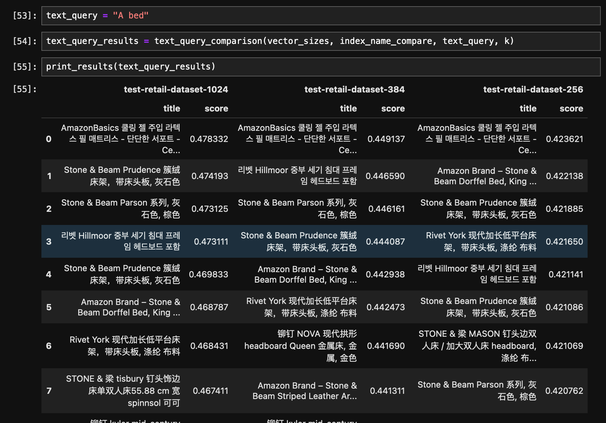
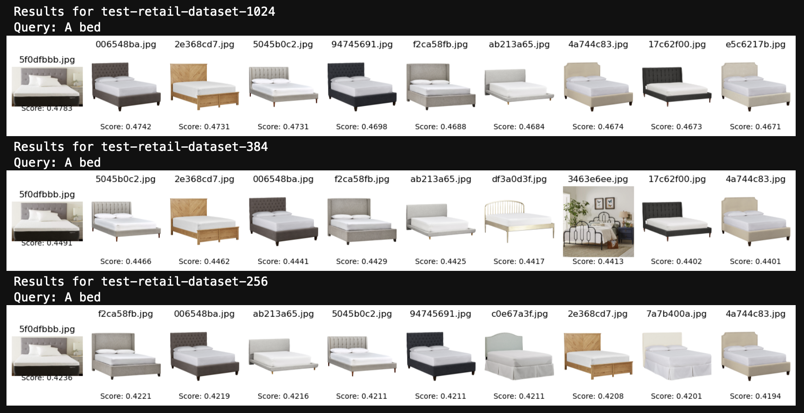

# Content Search
### Overview

Multimodal embeddings have revolutionized the way we approach content search, particularly in the realm of image and text retrieval. These dense vector representations capture the semantic meaning and context of data across different modalities, enabling users to find relevant information seamlessly.

By leveraging multimodal embeddings, applications can facilitate cross-modal search, allowing users to query with text and retrieve relevant images or vice versa. For instance, a user can submit a text query describing a specific scene or object, and the system can retrieve visually relevant images based on the semantic similarities between the text and image embeddings. Conversely, users can upload an image and receive relevant textual information, such as descriptions, captions, or related articles. This bidirectional search capability opens up new avenues for exploration and discovery, providing users with a comprehensive and engaging experience across modalities.

### About the notebooks

This section will focus on content search across the Amazon Berkeley Objects (ABO) Dataset, which includes catalog images and product metadata. To streamline the process, we have divided it into two separate notebooks: one for data preparation and another for content search.

**Dataset preparation**

In the data preparation notebook, we will focus on retrieving and preparing a subset of the original Amazon Berkeley Objects (ABO) Dataset. This involves downloading the product metadata and extracting the items in English, as well as downloading the corresponding product images.

The notebook will guide you through the process of filtering and cleaning the metadata to obtain a curated subset of products with English descriptions. Additionally, it will handle the task of downloading the associated product images from the provided URLs. It's important to note that some images might not exist or may have been deleted, but the notebook code is designed to handle such cases by removing duplicates or missing items automatically.

**Content Search**

In the first section of the content search notebook, we will create a single index to showcase the content search use case with Amazon OpenSearch Serverless and Amazon Titan Multimodal Embeddings. This initial section will serve as an introduction and demonstration of the core functionality before diving into the comparison of different embedding vector sizes.

Here's an overview of what will be covered in this first section:

1. **Creating the embedding function**: We will implement a function that takes an image or text as input and generates the corresponding embedding using Amazon Titan Multimodal Embeddings.
2. **Setting up the vector store**: We will configure and create a single Amazon OpenSearch Serverless collection and index to store the product data and embeddings.
3. **Populating the vector database**: Using the embedding function and the prepared product data from the previous notebook, we will populate the index with the image embeddings and associated metadata.
4. **Querying via image or text**: The notebook will demonstrate how to query the vector database using either an image or a text query. For image queries, we will generate the embedding of the input image and search for the nearest neighbors in the vector database. For text queries, we will leverage the text embeddings generated by Amazon Titan Multimodal Embeddings and search for relevant images based on the semantic similarity between the text and image embeddings.
5. **Visualizing and evaluating results**: We will explore techniques for visualizing the retrieved images and metadata, as well as evaluating the relevance and quality of the search results.

This initial section will provide a hands-on introduction to the content search use case, allowing you to understand the core concepts and workflow before moving on to the comparison of different embedding vector sizes.

After completing this section, the notebook will then proceed to create three separate indexes, each with a different embedding vector size (1024, 384, and 256). This will enable you to compare the search results and evaluate the impact of the embedding vector size on the quality and relevance of the retrieved results.

### Clean-up

To clean up the resources and avoid incurring costs, you will need to delete the Amazon OpenSearch Serverless collection and indexes created during the content search process.