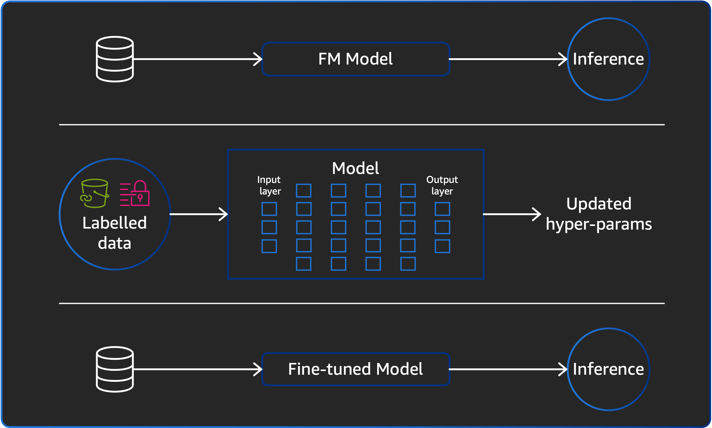
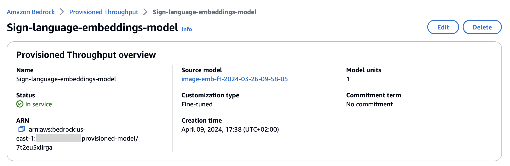

# Model Customization

### Overview

Multimodal embeddings have shown remarkable performance in capturing the semantics of data across different modalities, such as text, images, and video. However, in certain domains or specialized applications, the pre-trained models may not perform optimally out of the box. This is where fine-tuning comes into play, allowing you to adapt and customize the embeddings model to your specific domain or use case.

Amazon Bedrock offers a powerful feature called Custom Models, which enables you to fine-tune Amazon Titan Multimodal Embeddings (TMME) models using your own domain-specific data. By leveraging this capability, you can enhance the performance and accuracy of the embeddings for your particular domain, unlocking new possibilities for your applications.

### About the notebook

This notebook provides an end-to-end example of fine-tuning an Amazon TMME model, demonstrating how you can adapt the model to better suit your domain. In this specific case, we will be training an embeddings model tailored for sign language images. Sign language is a visual-spatial modality, and fine-tuning the model with sign language data can improve its ability to capture the nuances and semantics of this unique domain.

The notebook will guide you through the entire process, from preparing your domain-specific data to fine-tuning the TMME model using Amazon Bedrock's Managed Model Customization. You will learn how to configure the fine-tuning process, monitor its progress, and ultimately deploy the fine-tuned model for inference.

**Preparing the training and validation datasets**

To prepare the training dataset for fine-tuning the Amazon Titan Multimodal Embeddings model, you will need to create a `.jsonl` file with multiple JSON lines. Each JSON line should contain two attributes: `"image-ref"` and `"caption"`, following a format similar to the SageMaker Augmented Manifest format.

Here's an example of what the `.jsonl` file should look like:

```
{"image-ref": "s3://your-bucket/folder1/0001.png", "caption": "some text for image 0001"}
{"image-ref": "s3://your-bucket/folder2/0002.png", "caption": "some text for image 0002"}
{"image-ref": "s3://your-bucket/folder1/0003.png", "caption": "some text for image 0003"}

```

In this example, each JSON line represents a single training instance, where `"image-ref"` is the Amazon S3 path to the corresponding image file, and `"caption"` is the text description or label associated with that image. It's important to note that auto-captioning is not currently supported, so you will need to provide the captions or text descriptions manually for each image in your dataset.

Additionally, you will need to prepare a separate validation dataset in the same `.jsonl` format.

When creating the `.jsonl` file, ensure that the Amazon S3 paths for the image files are in the same folders where you have provided permissions for Amazon Bedrock to access the data. This can be done by attaching an appropriate IAM policy to your Amazon Bedrock service role, granting read access to the specific S3 buckets and folders containing your image data.

By following this format and providing the necessary permissions, you can prepare your training and validation datasets for fine-tuning the Amazon Titan Multimodal Embeddings model using Amazon Bedrock's managed model customization.

**Fine-tuning the multimodal embeddings model**

In this section, we configure the fine-tuning job for the Amazon Titan Multimodal Embeddings model using the Amazon Bedrock service. This involves setting various parameters and providing the necessary information to initiate the fine-tuning process.

We define the hyperparameters for the fine-tuning process, such as the number of epochs, batch size, and learning rate. These hyperparameters can be adjusted to optimize the fine-tuning performance for your specific use case.

- The `epochsCount` hyperparameter determines the number of complete passes through the entire training dataset during the fine-tuning process. A higher number of epochs generally leads to better convergence and model performance, but it also increases the training time.
- The `batchSize` hyperparameter specifies the number of training instances (image-caption pairs) that should be processed together in each iteration. Larger batch sizes can improve computational efficiency but may require more memory.
- The `learningRate` hyperparameter controls the step size at which the model's weights are updated during the fine-tuning process. A higher learning rate can lead to faster convergence, but it may also cause the model to diverge or become unstable if set too high.

With all these configurations in place, we can initiate the fine-tuning job using the Amazon Bedrock API or SDK. The fine-tuning process will adapt the pre-trained Amazon Titan Multimodal Embeddings model to your domain-specific data, in this case, sign language images and their associated captions. Once the fine-tuning is complete, the resulting fine-tuned model can be deployed for inference or provisioning, as discussed in the previous sections.



**Provision the customized model**

After successfully fine-tuning the model using Amazon Bedrock's Managed Model Customization feature, you can provision the fine-tuned model for inference. Provisioning involves allocating dedicated compute resources for the model, ensuring that it is always available and ready to serve requests without the need for cold starts or warm-up periods.

Once the fine-tuned model is provisioned, you can interact with it using the Amazon Bedrock API or SDK, sending inference requests and receiving the corresponding embeddings. These embeddings will be tailored to your domain-specific data, thanks to the fine-tuning process, enabling more accurate and relevant results for your applications.



**Compare the results**

Once the fine-tuned model is provisioned, we will test its performance against the base model by creating two Amazon OpenSearch Serverless indexes and populating them with hand sign language image embeddings. Each index will be populated using embeddings generated by its respective model: the base model and the fine-tuned model.

To facilitate this comparison, we will follow these steps:

1. **Create Amazon OpenSearch Serverless indexes**: We will create two separate Amazon OpenSearch Serverless indexes, one for the base model embeddings and another for the fine-tuned model embeddings.
2. **Populate indexes with embeddings**: For each index, we will generate embeddings for a set of hand sign language images using the corresponding model (base or fine-tuned). These embeddings, along with the image metadata, will be indexed in the respective Amazon OpenSearch Serverless index.
3. **Query indexes for alphabet letters**: Once the indexes are populated, we will query them to retrieve images related to specific alphabet letters in hand sign language. This will allow us to evaluate the retrieval performance of each model for a specific task.
4. **Compare retrieval results**: We will compare the retrieval results from both indexes by analyzing a batch of test images. For each test image, we will generate embeddings using both models and query the respective indexes to retrieve the most similar images. By comparing the retrieved images to the ground truth, we can assess the precision and accuracy of each model for the hand sign language domain.
5. **Evaluate precision**: To quantify the performance difference between the base model and the fine-tuned model, we will calculate the precision metric for each model. Precision measures the fraction of retrieved instances that are relevant, providing an indication of the model's ability to accurately retrieve relevant images for the given task.

By following this approach, we can directly compare the performance of the fine-tuned model against the base model for the specific domain of hand sign language image retrieval. The use of Amazon OpenSearch Serverless indexes allows us to efficiently store and query the embeddings, while the precision metric provides a quantitative measure of the models' performance.

```
   Letter                    Base Result              Fine-tuned Result
0       A  The letter Q in sign language  The letter S in sign language
1       B  The letter F in sign language  The letter B in sign language
2       C  The letter F in sign language  The letter C in sign language
3       D  The letter Q in sign language  The letter D in sign language
4       E  The letter F in sign language  The letter N in sign language
5       F  The letter F in sign language  The letter F in sign language
6       G  The letter Q in sign language  The letter G in sign language
7       H  The letter V in sign language  The letter H in sign language
8       I  The letter V in sign language  The letter I in sign language
9       J  The letter Q in sign language  The letter J in sign language
10      K  The letter V in sign language  The letter K in sign language
11      L  The letter Q in sign language  The letter Y in sign language
12      M  The letter Q in sign language  The letter T in sign language
13      N  The letter F in sign language  The letter M in sign language
14      O  The letter F in sign language  The letter O in sign language
15      P  The letter Q in sign language  The letter P in sign language
16      Q  The letter F in sign language  The letter Q in sign language
17      R  The letter V in sign language  The letter R in sign language
18      S  The letter F in sign language  The letter S in sign language
19      T  The letter F in sign language  The letter M in sign language
20      U  The letter V in sign language  The letter U in sign language
21      V  The letter V in sign language  The letter V in sign language
22      W  The letter V in sign language  The letter W in sign language
23      X  The letter V in sign language  The letter X in sign language
24      Y  The letter V in sign language  The letter Y in sign language
25      Z  The letter V in sign language  The letter Z in sign language
```

This evaluation process will demonstrate the benefits of fine-tuning the Amazon Titan Multimodal Embeddings model using domain-specific data, highlighting the potential improvements in retrieval accuracy and relevance for specialized applications like sign language recognition or content analysis.

### Clean-up

To avoid incurring unnecessary costs, it's essential to clean up the resources used during this process. This includes deleting the OpenSearch Serverless collections, the provisioned model, the customized model, and the Amazon S3 bucket containing the training and validation datasets.