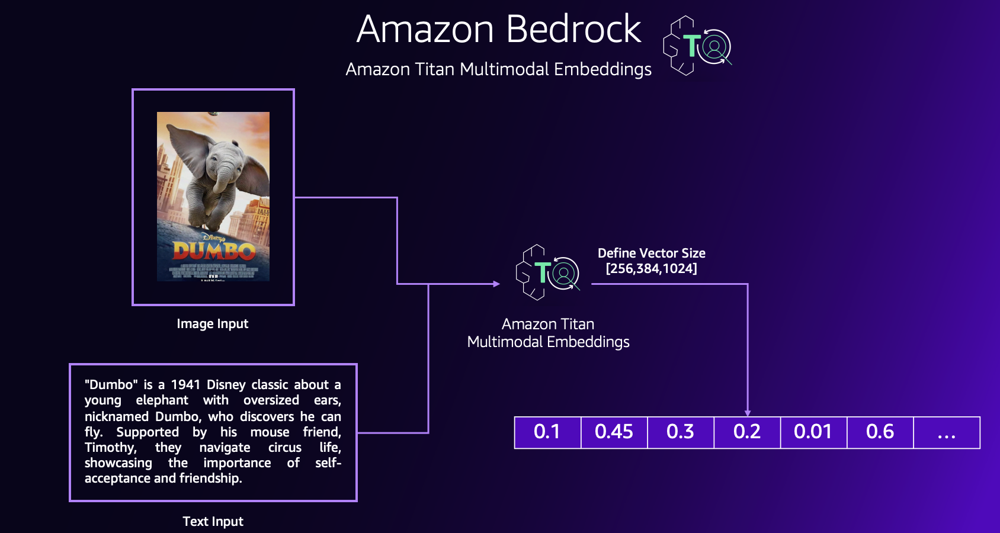

## Titan Multimodal Embedding Workshop

#### Welcome to the Amazon Titan Multimodal Embeddings workshop!

The goal of this workshop is to give you hands-on experience leveraging Amazon Titan Multimodal Embeddings through Amazon Bedrock. Here is a quick definition for both elements:

- **Amazon Bedrock** is a fully managed service that provides access to FMs from third-party providers and Amazon; available via an API. With Bedrock, you can choose from a variety of models to find the one that’s best suited for your use case.

- **Amazon Titan Multimodal Embeddings** is a multimodal embeddings model for use cases like searching images by text, image, or a combination of text and image. Designed for high accuracy and fast responses, this model is an ideal choice for search and recommendations use cases.

Within this series of labs, you will be taken through some of the most common usage patterns we are seeing with our customers for Generative AI and Multimodal Embeddings.

**What’s included in this workshop:**

1. Getting Started
2. Image Clustering
3. Content Search
4. Model Customization
5. Video Search **[Coming Soon]**
6. Content Tagging **[Coming Soon]**
7. Retrieval Augmented Generation **[Coming Soon]**

**Time to complete the workshop**: 3 hours

## Security

See [CONTRIBUTING](CONTRIBUTING.md#security-issue-notifications) for more information.

## License

This library is licensed under the MIT-0 License. See the LICENSE file.

